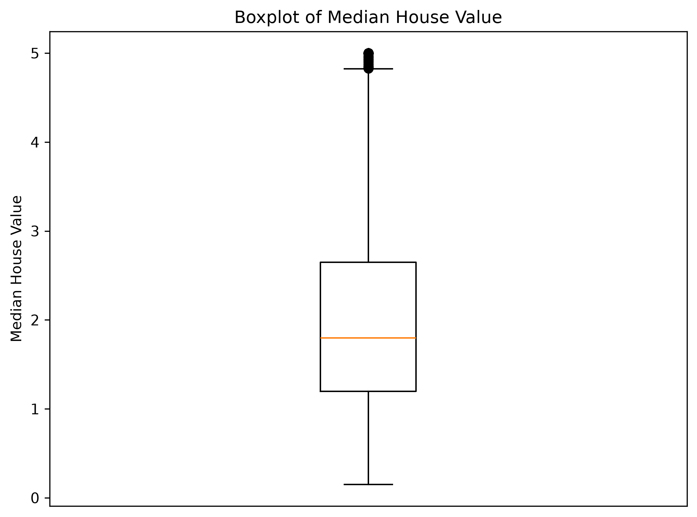

# A01 Assignment
Data: California Housing dataset<br>
Python version: 3.14.5

## How to run the script
Run the following commands one by one in your terminal: <br>
```
git clone https://github.com/vitosaveroaw/A01_5512
cd A01_5512
pip install -r requirements.txt
python src/boxplot.py
```

## Expected Output
After you run boxplot.py, the plot will be saved to figs/boxplot.png. <br>
